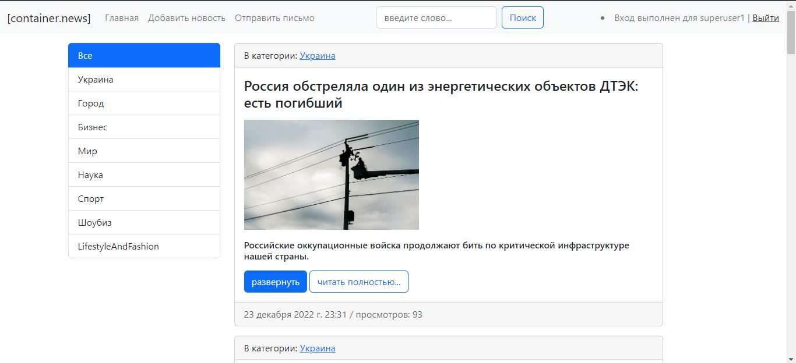
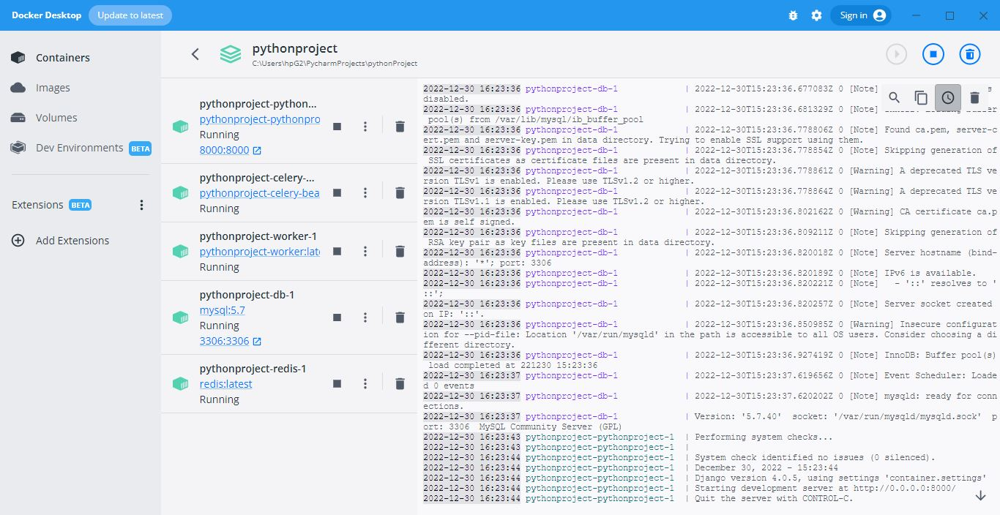

# container_news is a Django news agregator website project.
The application performs data web scraping asynchronously using SQL database to store and render data.
The initial data is taken from an open source.
### Used tools and techs: Django, Docker compose, MySQL, BeautifulSoup, Celery beat, Redis, HTML, Bootstrap, CSS

### App Preview:

<table width="100%"> 
<tr>
<td width="50%">      
&nbsp; 
 

  Homepage

</td> 
<td width="50%">
 

  Docker containers

  
</td>
</table>
